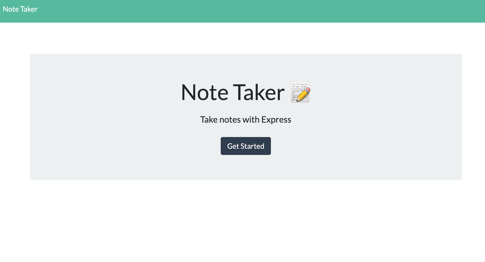
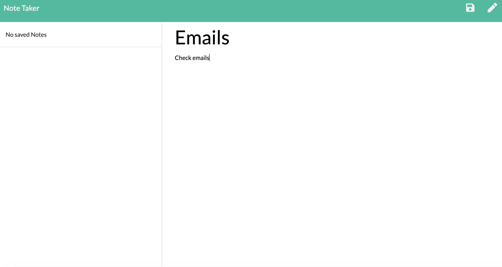
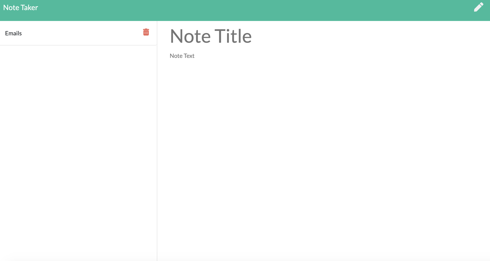

# Note-Taker

For this assignment, we were tasked to make an application that can be used to write, save and delete notes. This application has an express backend and saves and retrieves note data from a JSON file.

## Contents

This application consists of 1 main file, server.js and two folders, db and public which have the JSON file and HTML files in them. There is also the package JSON files for the dependancies used for this application. This images folder contains the screenshots used for this README.

## User Story

AS A user, I want to be able to write and save notes 
I WANT to be able to delete notes I've written before 
SO THAT I can organise my thoughts and keep track of tasks I need to complete

## Screenshots

## Link To The Application

<a href="https://warm-falls-70953.herokuapp.com/">Link to the Heroku App</>

## Installation

To use this application, first run npm install to install the following packages that are dependancies which is stated in the package.json file.

- inquirer
- express

The application itself can be invoked with the following command.

node server.js

Once the app is listening on the selected PORT, you are able to enter into your browser localhost: PORT and the application will run in the browser.

## Built With

- VS Code (https://code.visualstudio.com/)
- Terminal
- Express

## License

This application does not have a license.

## Author

Chloe Blackwell 
Email: chloeblackwell2@hotmail.com
